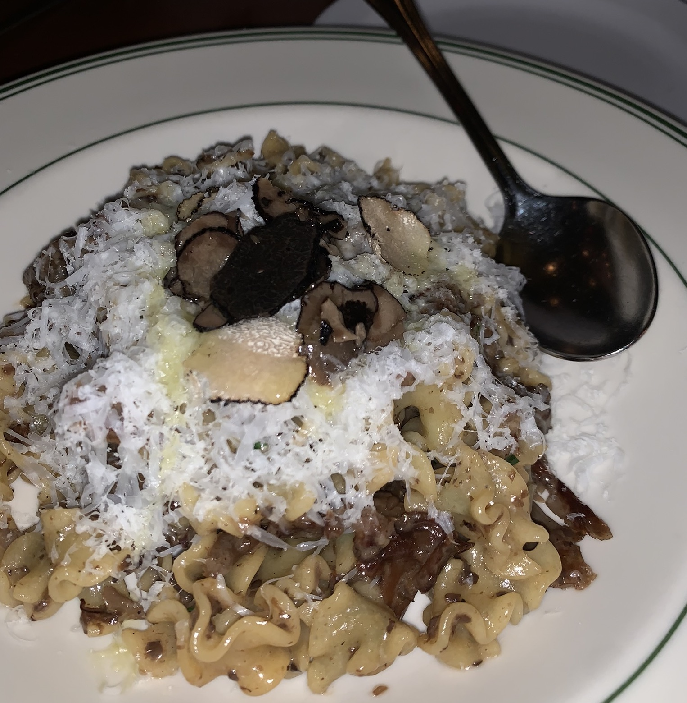
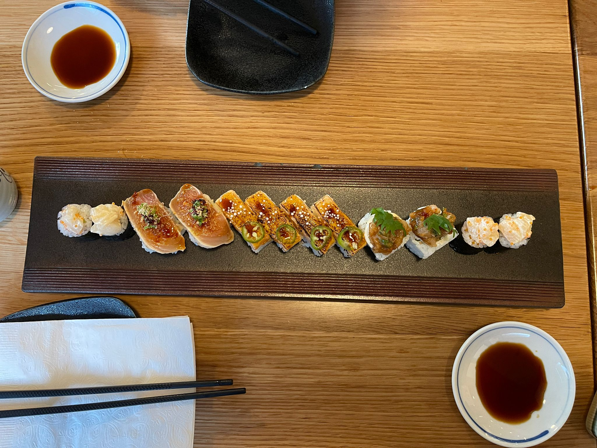
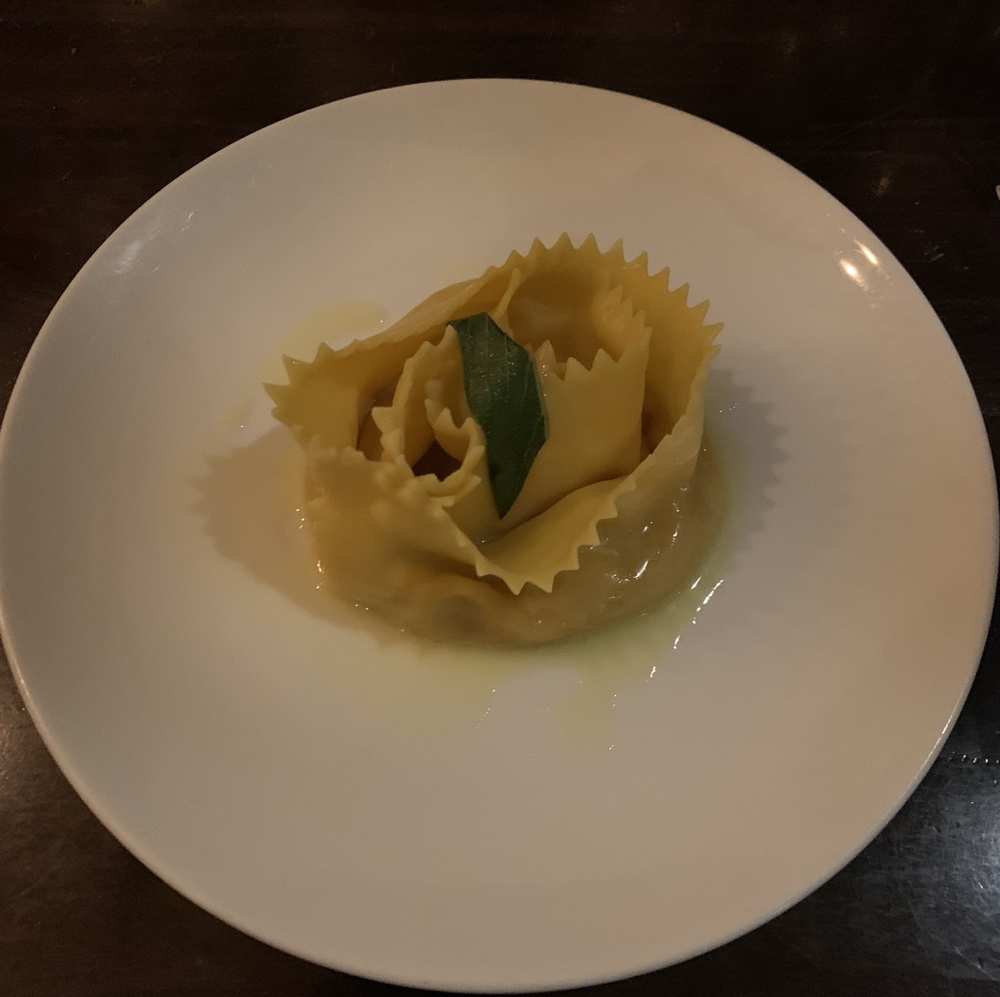
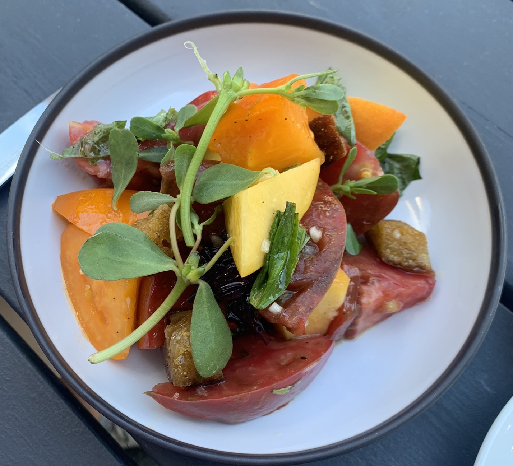
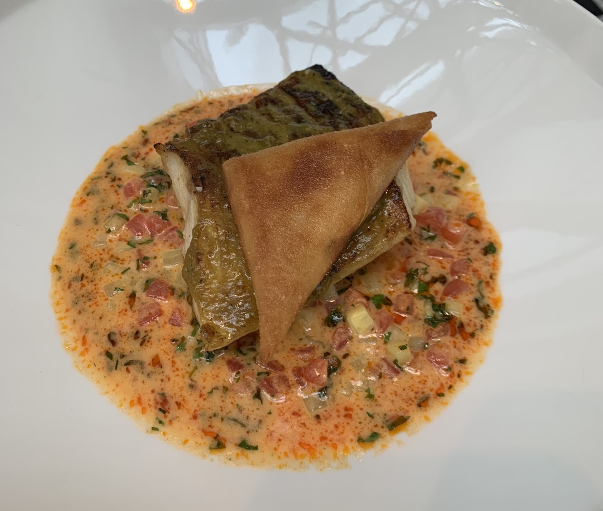
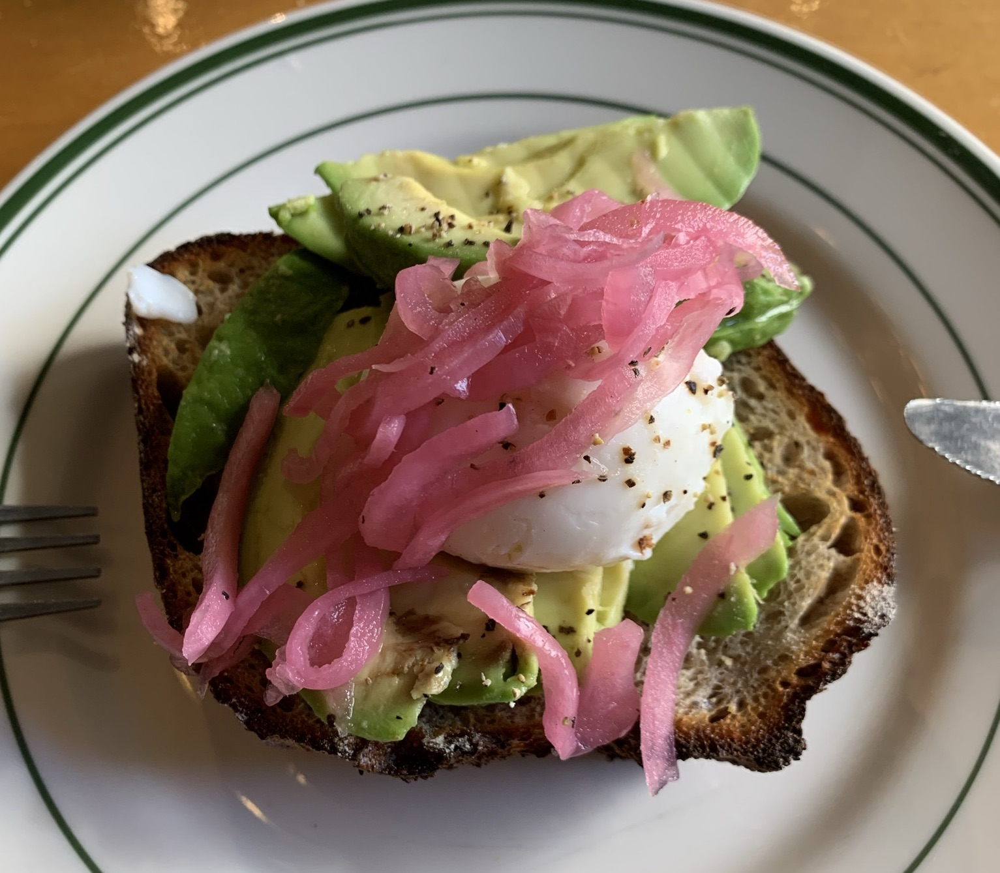

Eating is definitely a huge portion of what I enjoy (and spend). Since my teenage years, I have had a habit to spend nothing of my budget on clothing and spare it for food. It is still the case. 

As such a person I love being in Vancouver. It has a very but very very diverse food scene. You can compare the sushi quality to Japan, and the pasta quality to Italy… 

Here  I just want to document a few of the amazing bites I had in this city. I don't remember their name and all ingredients, but I will explain as I can.

<figure>
  
  <figcaption>An amazing pasta with wild mushrooms at Ask for Luigi. </figcaption>
</figure>

<figure>
  
  <figcaption>The sushi assortment at Sushi Hil. This is a very special sushi place that deserves every compliment and sushi aburi sitting a the middle of this row will be one the favourite bites of my life. </figcaption>
</figure>

<figure>
  
  <figcaption>This butternut squash-filled pasta at Oca Pastifico is one of the top pasta I’ve ever had. As a huge fan of butternut squash, it is hard for me to dislike any food with it. But the freshness, quality and harmony of everything makes this a top-level. </figcaption>
</figure>

<figure>
  
  <figcaption>This is the bite at Dachi everyone looks for in the summer. After this plate I found the farmer of each plant on the table and bought plenty more for home (really). For how many plates do you do that in your life? </figcaption>
</figure>

<figure>
  
  <figcaption>The crustiness of the skin and the smoothness of the sauce makes this sablefish a top-class at Labbatoir. Thanks to sablefish, there is at least a local fish that I like. </figcaption>
</figure>

<figure>
  
  <figcaption> A basic and bold bite at Birds & Beets. It is easy to impress me with this high-quality house-made bread and fermented onions. </figcaption>
</figure>

Restaurants:

- [Ask for Luigi](https://www.askforluigi.com/)
- [Sushi Hil](https://www.sushihil.com/)
- [Oca Pastifico](https://ocapastificio.com/)
- [Dachi](https://dachivancouver.com/)
- [Labbatoir](https://www.labattoir.ca/)
- [Birds and Beets](https://www.birdsandbeets.ca/)

