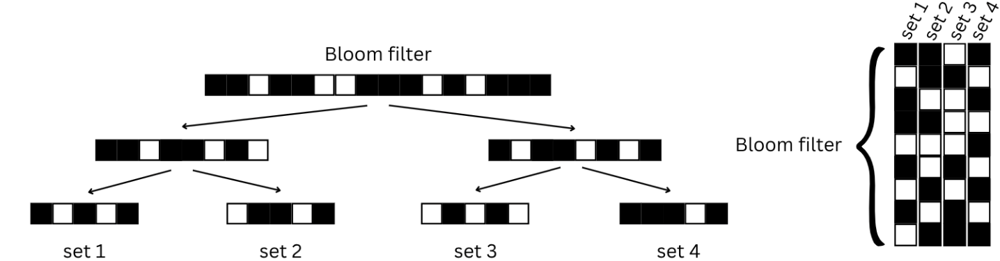

Probabilistic data structures can provide memory efficiency in large genomics experiments with tunable false positive rates (FPR). Bloom filter (BF) is one of bioinformatics's most widely used probabilistic data structures. BF is a membership data structure to query the presence or absence of an element in a set.

BFs are extensively used in applications such as contamination screening, quality assessing, or De Bruijn Graph representation. BF does not store associated data with k-mers and therefore does not provide any associative information about k-mers indexed. Thus, to leverage the memory efficiency of BF in other domains, such as classification, researchers looked for ways to extend the capabilities of BF by workflows.

<figure>
  
  <figcaption>Tree-based and matrix-based associative Bloom filter-based data structures. Black boxes represent ‘1’ and white boxes represent ‘0’ in Bloom filters. Sequence Bloom trees (left) stores BFs in a binary tree. To query the membership of a sequence of sets, query operation starts in the root node only the corresponding sets of the leaf nodes returned. BIGSI (right) stores multiple BFs together in a matrix shaped. Each column is a BF of a set and the matrix BF is stored row-wise for cache optimization. </figcaption>
</figure>

References:
- Sequence Bloom Trees: https://www.nature.com/articles/nbt.3442
- BIGSI: https://www.nature.com/articles/s41587-018-0010-1

